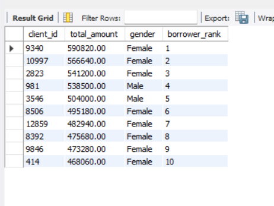
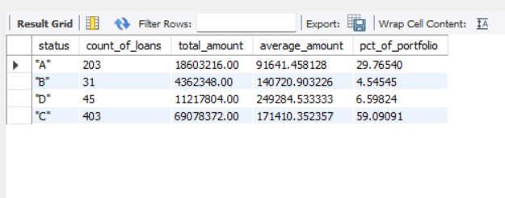
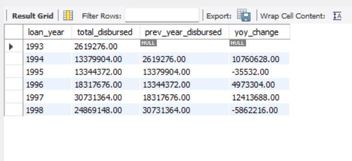

# Czech Bank Loan Analysis

SQL analysis of real Czech banking data (1993–1998) covering loan portfolio health, client demographics, and transaction trends across five relational tables.

---

## Dataset

- **Name:** PKDD 1999 Czech Financial Dataset (Berka)
- **Source:** Kaggle — search "Czech Financial Dataset Berka" or "PKDD 1999 financial dataset"
- **Domain:** Banking / Financial Services
- **Date Range:** 1993–1998

| Table | Approx. Rows |
|-------|-------------|
| account | ~4,500 |
| client | ~5,369 |
| disp | ~5,369 |
| loan | ~682 |
| trans | ~1,056,320 |

---

## Schema Overview

| Table | Approx. Rows | Key Columns |
|-------|-------------|-------------|
| `account` | ~4,500 | account_id, district_id, frequency, date_opened |
| `client` | ~5,369 | client_id, birth_number, district_id |
| `disp` | ~5,369 | disp_id, client_id, account_id, type |
| `loan` | ~682 | loan_id, account_id, date_issued, amount, duration, payments, status |
| `trans` | ~1,056,320 | trans_id, account_id, date_trans, type, amount, balance |

The `disp` table acts as the bridge between `client` and `account`, recording whether a client is the account owner or an authorised user. Both `loan` and `trans` link back to `account` via `account_id`, enabling analysis of lending behaviour and cash flow at the account level.

---

## SQL Techniques Used

- INNER JOIN
- 3-table JOIN (client → disp → account → loan)
- LEFT JOIN + IS NULL (anti-join pattern)
- Multi-level CTE
- DENSE_RANK (window function)
- LAG (window function for year-over-year comparison)
- Running SUM with PARTITION BY
- Conditional aggregation (SUM CASE WHEN)
- Portfolio percentage using window function inside GROUP BY result
- CASE WHEN for status labelling and risk classification
- SUBSTRING + CAST for gender derivation from birth_number

---

## Query Table

| # | Business Question | Technique |
|---|-------------------|-----------|
| Q1 | Which account types carry the highest loan volume? | INNER JOIN, GROUP BY |
| Q2 | What are client demographics and their loan status? | 3-table JOIN, LEFT JOIN, CASE WHEN, SUBSTRING + CAST |
| Q3 | Which accounts have no loan history? | LEFT JOIN + IS NULL |
| Q4 | Who are the top 10 highest-borrowing clients? | Multi-level CTE, DENSE_RANK |
| Q5 | What is the loan portfolio health breakdown? | GROUP BY, window function for portfolio % |
| Q6 | Which accounts show net positive transaction flow? | CTE, conditional aggregation |
| Q7 | How has annual loan disbursement changed year-over-year? | CTE, LAG |
| Q8 | What is the monthly transaction volume trend? | GROUP BY YEAR/MONTH |
| Q9 | What is the running transaction total per account? | SUM OVER PARTITION BY |
| Q10 | How can loan accounts be classified by risk? | INNER JOIN, CASE WHEN |

---

## Key Findings

- **Portfolio health:** Nearly 60% of loans are active with on-time payments. Over 6% are active but in arrears — the primary risk segment requiring closer monitoring.
- **Repayment history:** Around 30% of loans have been fully repaid without default; approximately 5% were eventually repaid after a period of default.
- **Disbursement trend:** Loan disbursements grew from approximately 2.6M Kč in 1993 to a peak of over 30M Kč in 1997, followed by a decline to around 25M Kč in 1998.
- **Untapped lending opportunity:** Accounts with no loan history that also show net positive cash flow are strong candidates for future loan products — this segment is only visible by combining Q3 and Q6 results, not from either query alone.

---

## Screenshots

| Query | Screenshot |
|-------|-----------|
| Q4 — Top 10 borrowers with rank |  |
| Q5 — Portfolio health breakdown |  |
| Q7 — Year-over-year disbursement |  |
| Q9 — Running transaction total (3,000 rows) | [View Output](q9_running_total.csv) |

--- 

## How to Run

1. Download the PKDD 1999 Czech Financial Dataset from Kaggle and extract the CSV files
2. Place the CSVs in your MySQL Server's secure upload directory (e.g. `C:/ProgramData/MySQL/MySQL Server 8.0/Uploads/`)
3. Update the file paths in `czech_financial_setup.sql` if your directory differs
4. Open MySQL Workbench, create a schema named `czech_financial`, and run `czech_financial_setup.sql` to create all tables and load data
5. Verify row counts match the expected values shown in the setup script
6. Run `czech_financial_analysis.sql` to execute all 10 queries

---

## Tools Used

- MySQL 8.0
- MySQL Workbench
- Dataset: PKDD 1999 Czech Financial Dataset (Berka) via Kaggle
